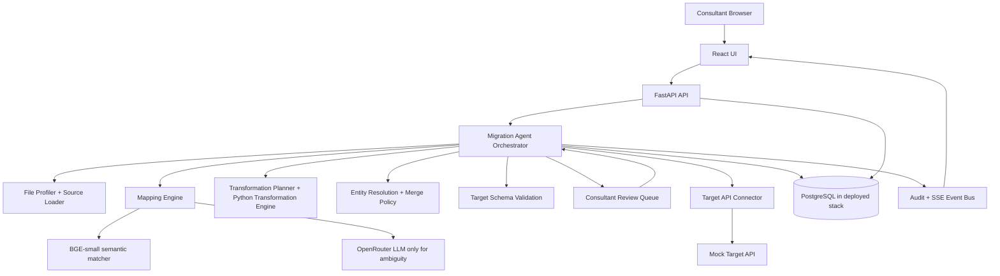

# Migration Copilot Architecture



## Design principles

1. **AI proposes; deterministic software executes.** The LLM never executes arbitrary code.
2. **Deterministic-first autonomy.** Strong aliases, type-compatible matches, safe transforms, and obvious identity matches proceed without an LLM.
3. **LLM only for judgment.** Ambiguous mappings, semantic value normalization, entity identification edge cases, and other judgment calls are sent to the LLM.
4. **Graceful AI failure.** After the configured retry window, a plausible deterministic fallback is used. Only cases with no safe fallback enter the consultant queue with `llm_unavailable`.
5. **Human approval for new transformations.** A transformation outside the supported library is proposed, shown with examples, and cannot run until approved.
6. **Every important action is observable and auditable.** LLM request logs, agent events, human decisions, target writes, retries, and rollbacks are recorded.

## Runtime data flow

```text
source files + target schema
        -> profiling
        -> entity identification
        -> candidate field mapping
        -> deterministic auto-resolution
        -> LLM only for ambiguous candidates
        -> transformation planning
        -> deterministic transformation execution
        -> entity resolution / merge
        -> target-schema validation
        -> consultant review if needed
        -> READY_TO_PUSH
        -> target API
        -> retry / rollback
        -> results + audit
```
